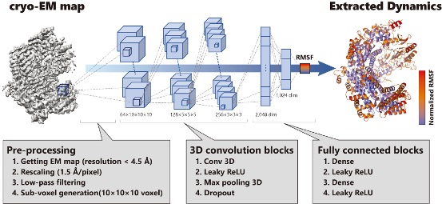
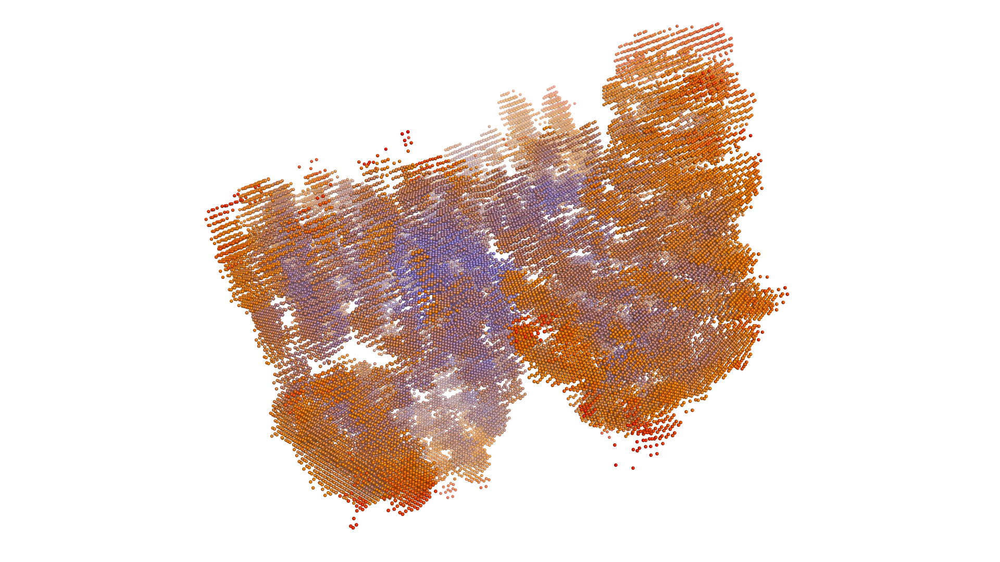
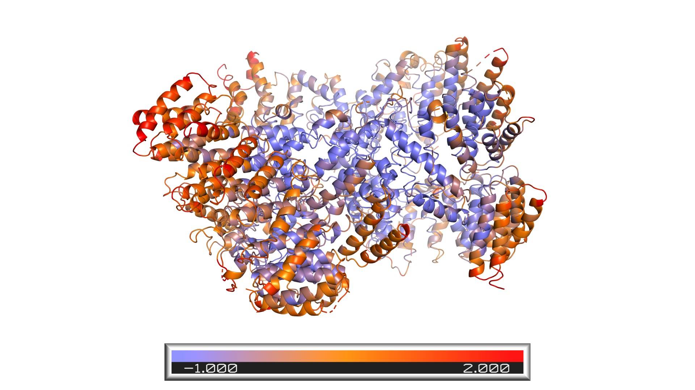

# DEFMap: Dynamics Extraction From cryo-em Map

This package provides an implementation of a dynamics prediction from a cryo-EM density map.

<div align="center">
  
</div>

## Dependency

### Environment

- Ubuntu: 16.04 or 18.04 (confirmed)
- [CUDA Toolkit](https://developer.nvidia.com/cuda-10.0-download-archive?target_os=Linux&target_arch=x86_64&target_distro=Ubuntu&target_version=1804&target_type=runfilelocal) version: 10.0 (any compatibility version is ok)
- NVIDIA driver version: 410.66 (any compatibility version is ok)

### Package

- *language*: English
- *python*: >3.6
- *keras-gpu*: 2.2.4
- tensorflow-gpu: 1.13.1
- *[htmd](https://software.acellera.com/academic-download-htmd.html)*: 1.15.2
- *[EMAN2](https://blake.bcm.edu/emanwiki/EMAN2)*: 2.3
- Pymol (optional):
- [UCSF Chimera](https://www.cgl.ucsf.edu/chimera/) (optional):

## Hardware requirements
DEFMap requires no specific high-end computer. For optimal performance, we recommended a computer with the following specs:
- RAM: 96+GB
- CPU: 12+ cores, 2.60 GHz.
- GPU: NVIDIA GeForce GTX1080Ti (or better GPU)

## Setup
Please refer to the following [link](doc/setup.md).
Typical installation time is expected to be less than 30 minutes.

## Example usage

### Usage 1: Dynamics Prediciton and Voxel Visualization
DEFMap only uses a cryo-EM map file for dynamics prediction and voxel visualization.

- **Scale voxel length and map resolution**

```bash
cd data
e2proc3d.py 015_emd_3984.map 015_emd_3984_5.0A_rescaled.mrc --clip=160,160,160 --scale=0.9 --process=filter.lowpass.gauss:cutoff_freq=0.2
# See the following link for e2proc3d.py options: https://blake.bcm.edu/emanwiki/EMAN2/Programs/e2proc3d
```

- **Create dataset**  

```bash
cd ../preprocessing/
python prep_dataset.py -m ../data/015_emd_3984_5.0A_rescaled.mrc -o ../data/sample.jbl -p
```

- **Inference**

```bash
cd ../
# It's going to take a while (less than 10 minutes depending on your computer).
python 3dcnn_main.py infer --test_dataset data/sample.jbl -o model/model_res5A.h5 --prediction_output result/prediction.jbl
```

The joblib output file contains python dictionary object (key: voxel coordinate, value: logarithm of RMSF).

- **Visualization**  
Decide a threshold of the map intensity using like [UCSF Chimera](https://www.cgl.ucsf.edu/chimera/).
Then, voxels with the intensity above the threshold will be selected for visualization.  
In this example, 0.0252 is used as the threshold.

First, run the following command.
```bash
python postprocessing/rmsf_map2grid.py -m ./data/015_emd_3984_5.0A_rescaled.mrc -p result/prediction.jbl -t 0.0252
```
Then, launch your GUI viewer that can visualize PDB file (in this tutorial, we use PyMol) and open 015_emd_3984_5.0A_rescaled.pdb.
Finally, run the following command (`show_as nb_spheres; spectrum b, slate_orange_red, minimum=-1, maximum=2`) in PyMOL command line, and you can see the following picture.

<div align="center">
  
</div>

### Usage 2: Dynamics Prediction and The Mapping onto Atomic Model
For atomic-level dynamics visualization, DEFMap needs a PDB file corresponding to the cryo-EM map used for inference. 

- **Scale voxel length and map resolution**  
```bash
cd preprocessing
python rescale.py -l ../data/sample_pdb_map.list -s 1.5 -r 5
```

- **Create dataset**  
```bash
python prep_dataset.py -m ../data/015_emd_3984_5.0A_rescaled.mrc -o ../data/sample.jbl -p
```

- **Inference**  

```bash
cd ../
# It's going to take a while (less than 10 minutes depending on your computer).
python 3dcnn_main.py infer --test_dataset data/sample.jbl -o model/model_res5A.h5 --prediction_output result/prediction.jbl
```

- **Visualization**  

First, run the following command to create dynamics-mapped pdb file.
```bash
cd postprocessing
python rmsf_map2model_for_defmap.py -l ../data/sample_for_visual.list -p ../result/prediction.jbl --normalize
```

Then, launch your GUI viewer that can visualize PDB file (in this tutorial, we use PyMol) and open *defmap_norm_model.pdb*.
Finally, run the following command (`spectrum b, slate_orange_red, minimum=-1, maximum=2`) in PyMOL command line, and you can see the following dynamics-mapped protein structure.

<div align="center">
  
</div>

### Usage 3: Dynamics Prediction Using Models Trained by Different Resolutions
Here, we shows the dynamics prediction using models trained by datasets low-pass filtered to 6Å and 7Å (the above examples used the dataset low-pass filtered to 5Å).

- **Scale voxel length and map resolution**

```bash
cd data
# for 6Å
e2proc3d.py 015_emd_3984.map 015_emd_3984_6A_rescaled.mrc --clip=160,160,160 --scale=0.9 --process=filter.lowpass.gauss:cutoff_freq=0.17
# for 7Å
e2proc3d.py 015_emd_3984.map 015_emd_3984_7A_rescaled.mrc --clip=160,160,160 --scale=0.9 --process=filter.lowpass.gauss:cutoff_freq=0.14
```

- **Create dataset**  

```bash
cd ../preprocessing/
# for 6Å
python prep_dataset.py -m ../data/015_emd_3984_6A_rescaled.mrc -o ../data/sample_6A.jbl -p
# for 7Å
python prep_dataset.py -m ../data/015_emd_3984_7A_rescaled.mrc -o ../data/sample_7A.jbl -p
```

- **Inference**

```bash
cd ../
# It's going to take a while.
# for 6Å
python 3dcnn_main.py infer --test_dataset data/sample_6A.jbl -o model/model_res6A.h5 --prediction_output result/prediction_6A.jbl
# for 7Å
python 3dcnn_main.py infer --test_dataset data/sample_7A.jbl -o model/model_res7A.h5 --prediction_output result/prediction_7A.jbl
```

The joblib output file contains python dictionary object (key: voxel coordinate, value: logarithm of RMSF).

## License
This package is licensed under the MIT License - see the [LICENSE](LICENSE) file for details.

## Authors
Shigeyuki Matsumoto: shigeyuki.matsumoto@riken.jp  
Shoichi Ishida: ishida.shouichi.57a@st.kyoto-u.ac.jp (maintainer)  

## Reference
```
@article {Matsumoto2020,
  author = {Matsumoto, Shigeyuki and Ishida, Shoichi and Araki, Mitsugu and Kato, Takayuki and Terayama, Kei and Okuno, Yasushi},
  title = {Extraction of Protein Dynamics Information Hidden in Cryo-EM Map Using Deep Learning},
  year = {2020},
  doi = {10.1101/2020.02.17.951863},
  URL = {https://www.biorxiv.org/content/early/2020/02/18/2020.02.17.951863},
  journal = {bioRxiv}
}
```
